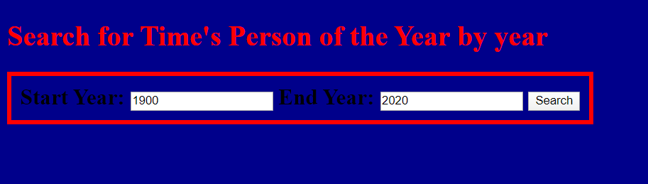
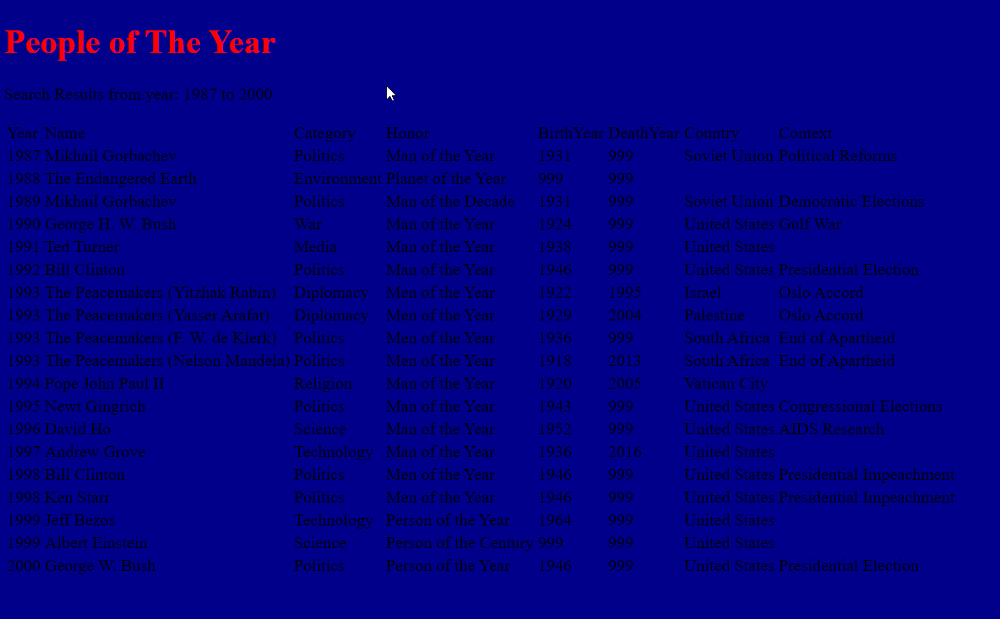

# Lab11-MVC
Lab11-MVC

**Summary** This application is designed to show you a list of Time'S Person
of the Year award Recipients. The user can either use the form on the index page 
to only see winners for a range years, or leave in the default values and see them all.

**Approach** This applications takes advange of the Model View Controller Architecture
of dotnet to create website, manage data file and user inpute, and sending out the resulting
data to the webpage. It also uses System.IO and LINQ

**Visual** 
- search form on the home page

- search results 

